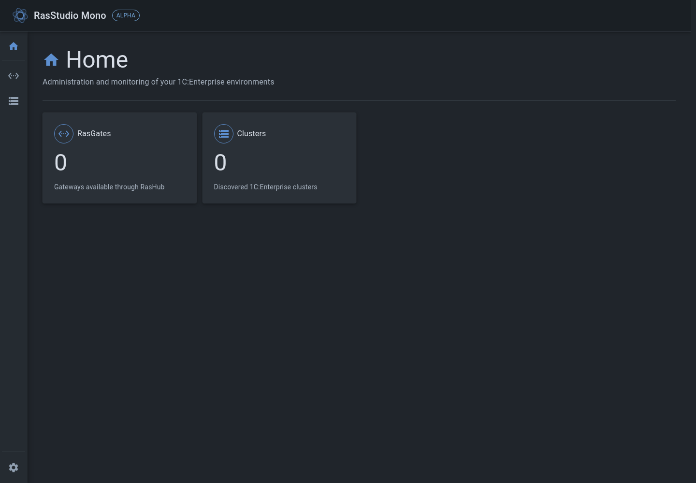

[English](README.md) \| [Русский](README.ru.md)

# RasStudio Mono

[](https://dotnet.microsoft.com/)
[](https://dotnet.microsoft.com/apps/aspnet/web-apps/blazor)
[](https://www.electronjs.org/)
[](#requirements)

RasStudio Mono is an experimental cross-platform desktop application for
managing 1C:Enterprise RAS infrastructure.

> **Note:** RasStudio Mono is an independent, experimental, alternative take on
> the RasStudio client, not the project's primary implementation. It comes with
> no guarantees of stability, feature completeness, or compatibility between
> releases. Its architecture, behavior, and local data formats may change
> without notice.



## Technology stack

- .NET 10 and ASP.NET Core/Kestrel — local application backend
- Blazor Interactive Server — UI runtime
- MudBlazor — component library
- Electron and ElectronNET.Core — cross-platform desktop shell and packaging
- SQLite and Nava.Settings — local application preferences

## Architecture

``` text
Electron window → Kestrel on 127.0.0.1 → Blazor Server
                                      ↓
                     RasHub → RasGate → RAC → RAS
```

Application preferences are stored in one local SQLite settings database:

- Windows: `%LOCALAPPDATA%\RasStudio\settings.db`
- Linux: `$XDG_DATA_HOME/RasStudio/settings.db`, normally
  `~/.local/share/RasStudio/settings.db`

`APP_PATH` can override the settings directory for development and tests.

## Requirements

- .NET 10 SDK
- Node.js 22 or newer
- Windows 10/11 or a Linux distribution supported by .NET and Electron

Clone the repository with its submodules:

``` bash
git clone --recurse-submodules https://github.com/RasEcosystem/ras-studio-mono.git
cd ras-studio-mono
```

Restore and build:

``` bash
make build
```

Run the unpackaged desktop application:

``` bash
make run
```

ElectronNET.Core binds Kestrel to a dynamically selected loopback-only port.
Closing the desktop window stops Electron and the backend process together.

## Packaging

Build a package for the current host OS:

``` bash
make package
```

Or select the target explicitly:

``` bash
make package-linux
make package-windows
```

Linux produces an x64 AppImage. Windows produces an x64 NSIS installer and a
portable executable. Electron packages are platform-specific: build Windows
packages on Windows and Linux packages on Linux (or through WSL where supported
by ElectronNET.Core). Results are written to `artifacts/desktop`.

## Verification

Run the full available verification suite:

``` bash
make test
```

The suite builds Release, captures all themes in desktop/mobile viewports, and
runs a real headless Electron lifecycle check that verifies Kestrel binds only
to `127.0.0.1` and exits when the desktop window closes.

## Related projects

- [RasStudio](https://github.com/RasEcosystem/ras-studio) — primary RAS
  infrastructure management client
- [RasHub](https://github.com/RasEcosystem/ras-hub-public) — centralized API
  and infrastructure management service
- [RasGate](https://github.com/RasEcosystem/ras-gate) — HTTP gateway for the
  Remote Administration Client

## License

RasStudio Mono is distributed under the [MIT License](LICENSE).
