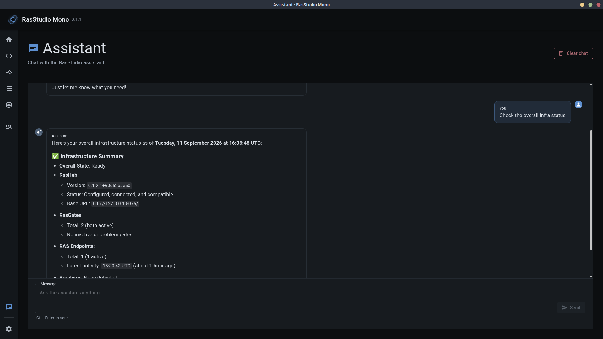

[English](README.md) \| [Русский](README.ru.md)

# RasStudio Mono

[](https://dotnet.microsoft.com/)
[](https://dotnet.microsoft.com/apps/aspnet/web-apps/blazor)
[](https://www.electronjs.org/)
[](#requirements)

RasStudio Mono is a desktop application for managing 1C:Enterprise servers and
clusters through RAS. It runs on Windows and Linux.

> **Note:** RasStudio Mono is experimental and comes with no guarantees of
> stability, feature completeness, or compatibility between releases. Its
> architecture, behavior, and local data formats may change without notice.


## RAS management

- register RasGates and assign RAS endpoints to them;
- browse, search, and filter clusters across active RAS endpoints; create, edit,
  remove, and refresh them through RasHub;
- browse and search infobases, filter by endpoint or cluster, and refresh one
  infobase or all infobases in the selected cluster.

Lists show data stored in RasHub. Run synchronization to fetch the current state
from RAS.

1C:Enterprise server agent and cluster administrator credentials are sent only
for the corresponding operation and are not stored by RasStudio.

## AI assistant

The assistant helps check the RasHub connection, inspect RasGate status, and
review recent application errors. It reads data through the protected embedded
MCP server and cannot change infrastructure.

It requires Ollama or another OpenAI-compatible server that does not require an
API key. Responses appear as they arrive. The server address and selected model
are saved in the application settings.



## Technology stack

- .NET 10 and ASP.NET Core/Kestrel — local application backend
- Blazor Interactive Server — UI runtime
- MudBlazor — component library
- Electron and ElectronNET.Core — cross-platform desktop shell and packaging
- SQLite and Nava.Settings — local application preferences

## Architecture

``` text
Electron window → Kestrel on 127.0.0.1 → Blazor Server
                                      ↓
               RasHub → RAS endpoint → assigned RasGate → RAC → RAS
```

Settings are stored in a local SQLite file:

- Windows: `%LOCALAPPDATA%\RasStudio\settings.db`
- Linux: `$XDG_DATA_HOME/RasStudio/settings.db`, normally
  `~/.local/share/RasStudio/settings.db`

`APP_PATH` can override the settings directory for development and tests.

## Requirements

- .NET 10 SDK
- Node.js 22 or newer
- RasHub 0.1.1 or newer for RAS endpoint management
- Windows 10/11 or a Linux distribution supported by .NET and Electron

Clone the repository with its submodules:

``` bash
git clone --recurse-submodules https://github.com/RasEcosystem/ras-studio-mono.git
cd ras-studio-mono
```

Restore and build:

``` bash
make build
```

Run the application from source:

``` bash
make run
```

The application's local server is accessible only from the same computer.
Its port is selected automatically, and it stops when the window closes.

## Packaging

Build a package for the current host OS:

``` bash
make package
```

Commands for each platform:

``` bash
make package-linux
make package-windows
```

To run tests, build the package, audit dependencies, and check the packaged
application on Linux:

``` bash
make release
```

Linux produces an AppImage. Windows produces an NSIS installer and a portable
executable. All packages target x64. Build each package on its target operating
system. Results are written to `artifacts/desktop`.

## Verification

Run the checks:

``` bash
make test
```

This builds the application in Release mode, checks formatting and dependencies,
and runs unit and integration tests. It also checks MCP authentication and
confirms that the local server stops when the window closes. Electron needs a
display or virtual display; CI uses Xvfb.

`make electron-audit` checks Electron dependencies for known vulnerabilities.
`make package-audit` checks the Node.js dependencies used to build and run the
package.

## Related projects

RasStudio Mono is part of the [Ras Ecosystem](https://github.com/RasEcosystem):

- [RasHub](https://github.com/RasEcosystem/ras-hub) — the central management
  service that connects RasStudio Mono to RasGate and provides a unified API;
- [RasGate](https://github.com/RasEcosystem/ras-gate) — HTTP gateway for the
  Remote Administration Client.

## License

RasStudio Mono is distributed under the [MIT License](LICENSE).
